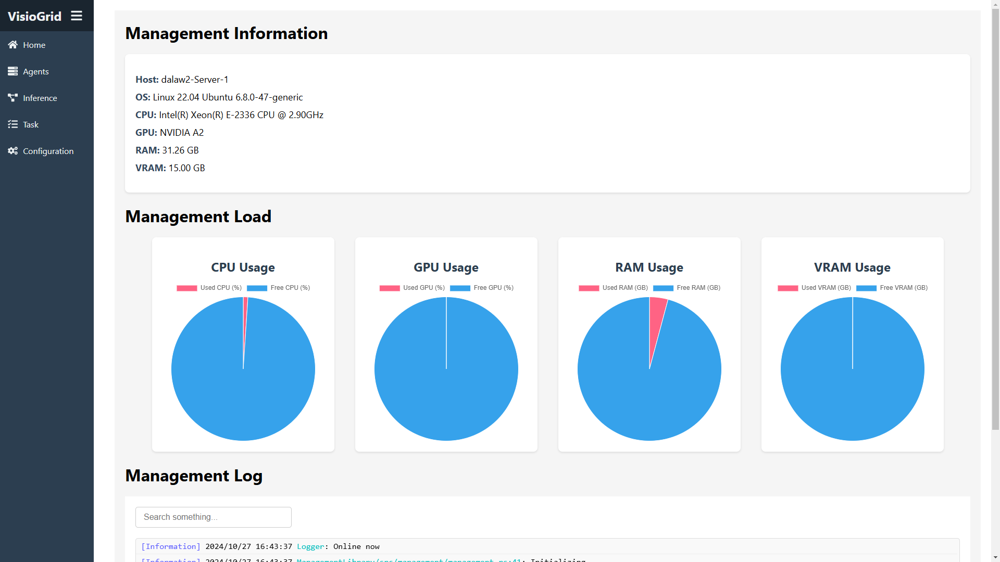
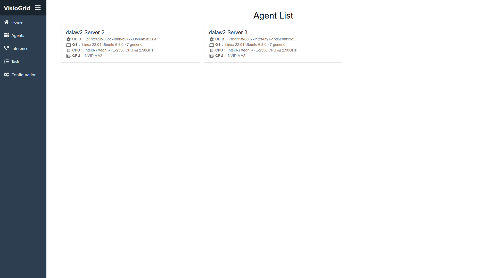
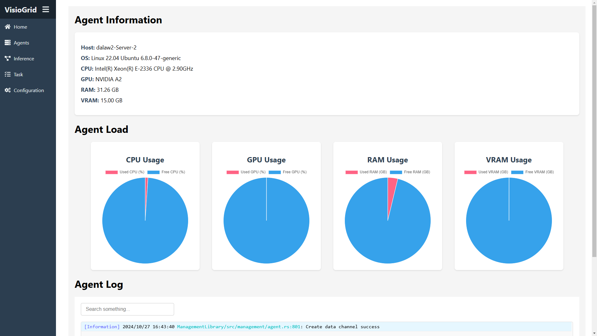
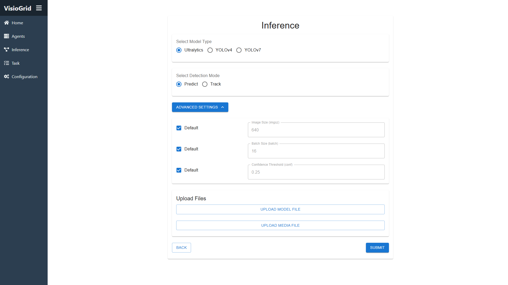
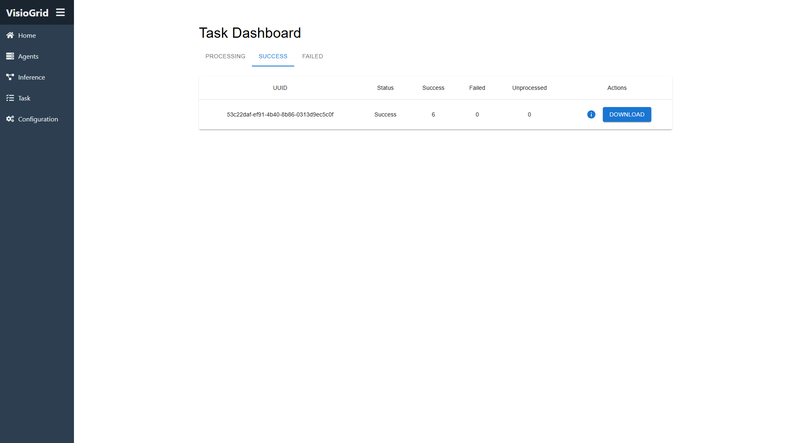
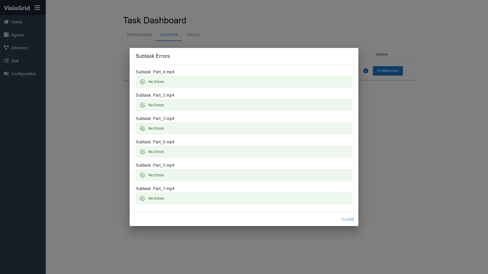
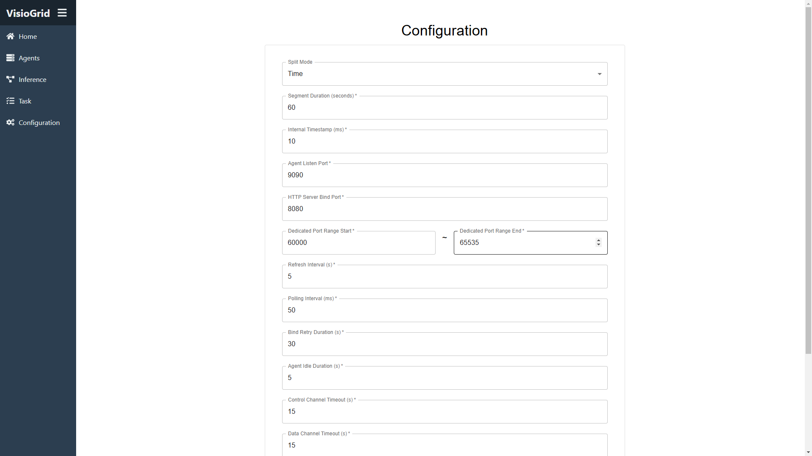

# VisioGrid

## Table of Contents
- [Project Introduction](#project-introduction)
- [Main Features](#main-features)
- [Tech Stack](#tech-stack)
- [Installation and Running](#installation-and-running)
- [Usage](#usage)

## Project Introduction
VisioGrid is a heterogeneous distributed computing platform developed in Rust, focusing on image recognition. The project aims to establish an efficient distributed system for large-scale image recognition processing. By parallel processing tasks in a multi-agent environment, VisioGrid enhances the efficiency and speed of image recognition.

## Main Features
- **High Efficiency**: Thanks to Tokio's asynchronous runtime and efficient I/O processing, VisioGrid can quickly handle large amounts of image data.
- **Stability**: Through real-time monitoring of agents and proactive error handling, the system runs stably, avoiding program crashes.
- **Image Recognition**: Supports multiple image recognition models, flexibly adapting to different application scenarios.

## Tech Stack
- **Rust**: Fully utilizes Rust's high performance and safety features to ensure efficient system operation.
- **Actix Web**: Provides a user-friendly web management interface for easy system management and monitoring.
- **Tokio**: Uses Tokio's asynchronous runtime for performance optimization, improving I/O processing efficiency.
- **GStreamer**: Used for handling media streams and content, supporting efficient processing of multimedia data.
- **Ultralytics**: Integrates Ultralytics for image recognition, supporting multiple advanced image recognition models.

## Installation and Running

### System Requirements
- **Nvidia GPU**: This program can only run on machines equipped with Nvidia GPUs.

### Compile from Source Code

#### Management Node
1. **Clone the Repository**
    ```bash
    git clone https://github.com/DaLaw2/VisioGrid
    cd VisioGrid
    ```
2. **Install Required Packages**
    ```bash
    bash build/ManagementDepend.sh
    ```
3. **Compile the Project**
    ```bash
    cargo build --release --package management
    ```
4. **Edit Configuration File**
    ```bash
    vim management.toml
    ```
5. **Run the Node**
    ```bash
    cargo run --package management --release
    ```

#### Agent Node

1. **Clone the Repository**
    ```bash
    git clone https://github.com/DaLaw2/VisioGrid
    cd VisioGrid
    ```
2. **Install Required Packages**
    ```bash
    bash build/AgentDepend.sh
    ```
3. **Activate Virtual Environment and Install Dependencies**
    ```bash
    python3 -m venv AgentVenv
    source AgentVenv/bin/activate
    pip3 install -r build/requirements.txt
    ```
4. **Compile the Project**
    ```bash
    cargo build --release --package management
    ```
5. **Edit Configuration File**
    ```bash
    vim agent.toml
    ```
6. **Run the Node**
    ```bash
    cargo run --package agent --release
    ```

### Using Docker
VisioGrid provides Docker containers that include all necessary dependencies, eliminating the need for manual installation.
1. **Create Docker Network** 
    ```bash
    docker network create VisioGrid
    ```
2. **Build the Management Node Container**
    ```bash
    cd build
    docker build -t management -f ManagementDockerfile
    ```
3. **Run the Management Node Container**
    ```bash
    docker run -it --rm --gpus all --network VisioGrid -p 8080:8080 management
    ```
4. **Build the Agent Container**
    ```bash
    cd build
    docker build -t agent -f AgentDockerfile
    ```
5. **Run the Agent Container**
    ```bash
    docker run -it --rm --gpus all --network VisioGrid agent
    ```

## Usage
Access `http://localhost:8080` via a web browser to view the management interface. The management interface provides system monitoring and management functions, allowing users to view system status, add agent nodes, check task progress, etc.
- The Home page provides an overview of the system, including system information, system load, and system logs.

  
- The Agents page displays all connected agent nodes. Clicking on an agent reveals more detailed information.

  
  
- The Inference page allows you to create a new inference task. After selecting a model and image, you can submit it.

  
- The Tasks page lists all tasks that are in progress, successful, or failed. You can view the execution status of each subtask.

  
  
- The Configuration page provides system configuration options, allowing users to modify system settings.

  
