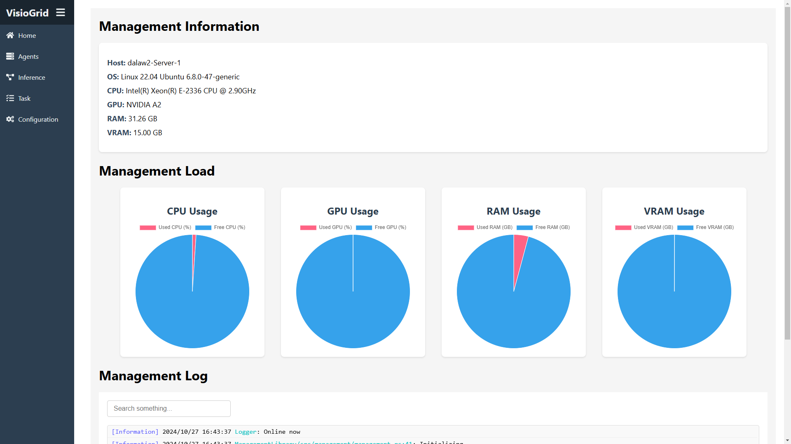
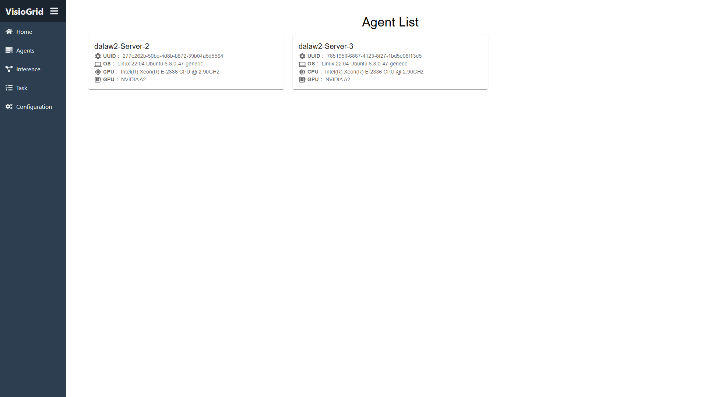
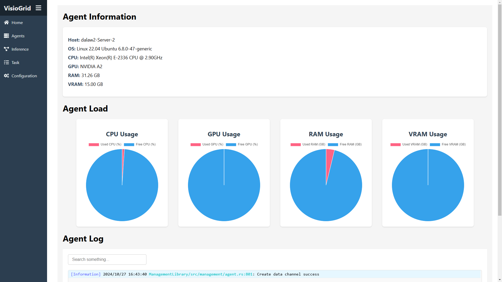
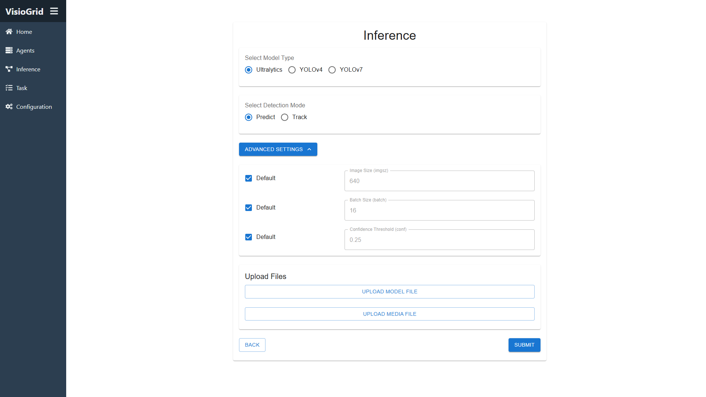
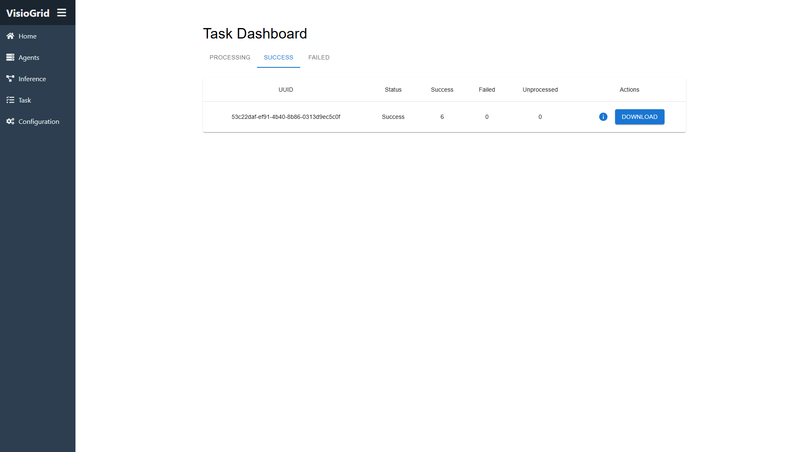
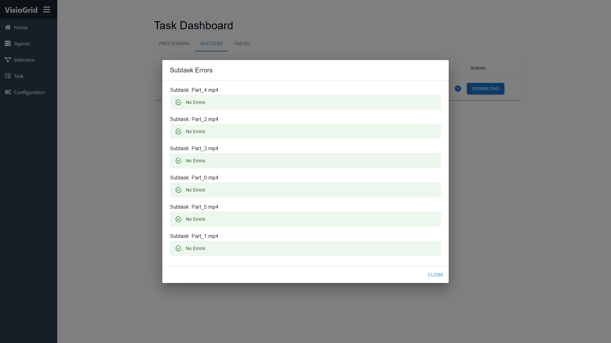
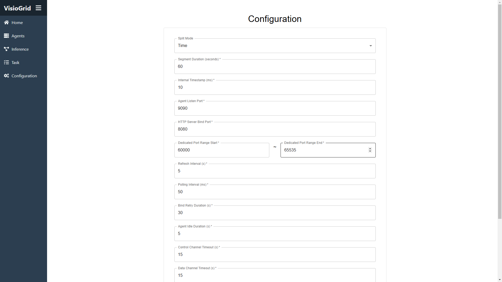

# VisioGrid

## 目錄
- [專案介紹](#專案介紹)
- [主要特性](#主要特性)
- [技術棧](#技術棧)
- [安裝與運行](#安裝與運行)
- [使用方法](#使用方法)

## 專案介紹
VisioGrid 是一個使用 Rust 開發的異質性分布式計算平台，專注於影像辨識。該項目旨在建立一個高效的分布式系統，用於處理大規模影像辨識。通過在多代理環境中並行處理任務，VisioGrid 提高了影像辨識的效率和速度。

## 主要特性
- **高效率**：得益於 Tokio 異步運行時高效的 I/O 處理，VisioGrid 能夠快速處理大量影像數據。
- **穩定性**：透過實時監控代理以及主動處理所有錯誤，保證系統運行穩定，避免程序崩潰。
- **影像辨識**：支持多種影像辨識模型，靈活應對不同的應用場景。

## 技術棧
- **Rust**：充分利用 Rust 的高性能和安全特性，確保系統高效運行。
- **Actix Web**：提供用戶友好的 Web 管理介面，方便管理和監控系統。
- **Tokio**：使用 Tokio 的異步運行時進行性能最佳化，提升 I/O 處理效率。
- **GStreamer**：用於處理媒體流和媒體內容，支持多媒體數據的高效處理。
- **Ultralytics**：集成 Ultralytics 進行影像辨識，支持多種先進的影像辨識模型。

## 安裝與運行

#### 系統要求
- **Nvidia GPU**：本程序僅能在配備 Nvidia GPU 的機器上運行。

### 從源代碼編譯

#### 管理節點
1. **克隆倉庫**
   ```bash
    git clone https://github.com/DaLaw2/VisioGrid
    cd VisioGrid
   ```
2. **安裝所需套件**
   ```bash
    bash Build/ManagementDepend.sh
   ```
3. **編譯專案**
   ```bash
    cargo build --release --package Management
   ```
4. **編輯配置文件**
   ```bash
   vim management.toml
   ```

5. **運行節點**
    ```bash
    cargo run --package Management --release
    ```

#### 代理節點
1. **克隆倉庫**
    ```bash
    git clone https://github.com/DaLaw2/VisioGrid
    cd VisioGrid
    ```
2. **安裝所需套件**
   ```bash
   bash Build/AgentDepend.sh
   ```
3. **啟動虛擬環境並安裝依賴**
   ```bash
   python3 -m venv AgentVenv
   source AgentVenv/bin/activate
   pip3 install -r Build/requirements.txt
   ```
4. **編譯專案**
   ```bash
   cargo build --release --package Management
   ```
5. **編輯配置文件**
    ```bash
   vim agent.toml
   ```

6. **運行節點**
    ```bash
    cargo run --package Agent --release
    ```

### 使用 Docker
VisioGrid 提供包含所有必要依賴的 Docker 容器，無需手動安裝。
1. **創建 Docker 網路**
    ```bash
    docker network create VisioGrid
    ```
2. **構建管理節點容器**
    ```bash
    docker build -t management -f Build/ManagementDockerfile
    ```
3. **運行管理節點容器**
    ```bash
    docker run -d --rm --gpus all --network VisioGrid -p 8080:8080 management
    ```
4. **構建代理容器**
    ```bash
    docker build -t agent -f Build/AgentDockerfile
    ```
5. **運行代理容器**
    ```bash
    docker run -d --rm --gpus all --network VisioGrid agent
    ```

## 使用方法
通過瀏覽器訪問 `http://localhost:8080`，可以查看管理介面。管理介面提供了系統的監控和管理功能，用戶可以查看系統狀態、添加代理節點、查看任務進度等。
- 首頁提供了系統的總體情況，包括了系統資訊、系統負載、系統日誌。
  
  
- 代理頁面顯示了所有連接的代理節點，點選代理可以看到更詳細的資訊。

  
  
- 推理頁面可以創建一個新的推理任務，選擇模型和影像後即可提交。
  
  
- 任務頁面列出了所有正在處理、成功、失敗的任務，可以查看每一個子任務執行的情況。
  
  
  
- 配置頁面提供了系統的配置選項，用戶可以修改系統的配置。
  
  
